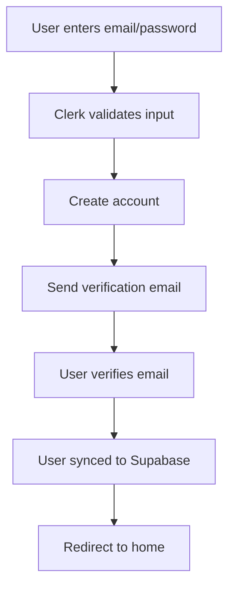
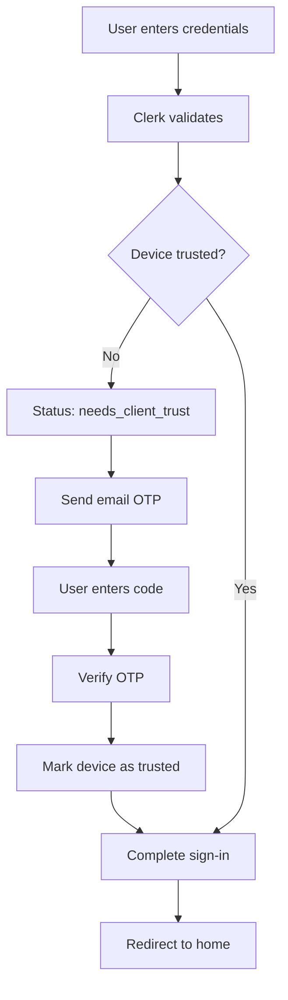

# 🏠 Kribb - Real Estate Mobile Application

<div align="center">


**A modern, feature-rich real estate mobile application built with Expo and React Native**

[Features](#-features) • [Tech Stack](#-tech-stack) • [Installation](#-installation) • [Security](#-security) • [Architecture](#-architecture) • [Screenshots](#-screenshots)

</div>

---

## 📋 Table of Contents

- [Overview](#-overview)
- [Features](#-features)
- [Tech Stack](#-tech-stack)
- [Architecture](#-architecture)
- [Security Features](#-security-features)
- [Installation](#-installation)
- [Environment Variables](#-environment-variables)
- [Database Schema](#-database-schema)
- [Authentication Flow](#-authentication-flow)
- [API Integration](#-api-integration)
- [Project Structure](#-project-structure)
- [Scripts](#-scripts)
- [Contributing](#-contributing)
- [License](#-license)

---

## 🌟 Overview

**Kribb** is a full-stack real estate mobile application that allows users to browse, search, save, and interact with property listings. The app features a robust authentication system, role-based access control, real-time filtering, and an intuitive user interface built with modern design principles.

### Key Highlights

- 🔐 **Enterprise-grade authentication** with Clerk (Email/Password + MFA)
- 🗄️ **Supabase backend** with Row-Level Security (RLS)
- 🎨 **Modern UI/UX** with NativeWind (Tailwind CSS for React Native)
- 🔍 **Advanced search & filtering** system
- 💾 **Real-time data synchronization**
- 👨‍💼 **Admin panel** for property management
- 📱 **Responsive design** optimized for iOS & Android
- 🗺️ **Interactive maps** with OpenStreetMap integration
- 💬 **WhatsApp integration** for direct agent contact

---

## ✨ Features

### 🔐 Authentication & Security

- **Email/Password Authentication** via Clerk
- **Multi-Factor Authentication (MFA)** with email OTP verification
- **Device Trust Verification** - Validates new devices with email codes
- **Secure token management** with Clerk's built-in token cache
- **Auto sign-out** on token expiration
- **Protected routes** with authentication guards
- **Row-Level Security (RLS)** on Supabase tables

### 🏡 Property Features

- **Featured Properties** carousel on home screen
- **Recommended Listings** with infinite scroll
- **Advanced Search** - Filter by title, city, type, bedrooms, price range
- **Save/Unsave Properties** with optimistic UI updates
- **Property Details** with:
  - High-resolution image carousel
  - Full-screen image viewer
  - Interactive map preview
  - WhatsApp contact integration
  - Detailed specifications (beds, baths, area, type)
  - Long-form descriptions with read more/less

### 👨‍💼 Admin Features

- **Role-based access control** (Admin/User)
- **Create Property Listings** (admin-only tab)
- **Mark Properties as Sold**
- **Delete Properties** with confirmation alerts
- **Admin status** synced from Supabase

### 🎨 UI/UX Features

- **Skeleton Loaders** for smooth loading states
- **Optimistic UI Updates** for better user experience
- **Pull-to-refresh** functionality
- **Empty states** with call-to-action buttons
- **Toast notifications** for user feedback
- **Smooth animations** and transitions
- **Dark mode support** (ready)

### 📱 User Profile

- **Profile Image Upload** with Clerk's image API
- **Image picker** with cropping support
- **Account management** interface
- **Help & Support** email integration
- **Settings** (coming soon)
- **Notifications** (coming soon)

---

## 🛠️ Tech Stack

### Frontend

| Technology | Version | Purpose |
|------------|---------|---------|
| [Expo](https://expo.dev) | ^51.0.0 | React Native framework & build tooling |
| [React Native](https://reactnative.dev) | 0.74.5 | Cross-platform mobile development |
| [TypeScript](https://www.typescriptlang.org) | ~5.3.3 | Type-safe JavaScript |
| [Expo Router](https://docs.expo.dev/router/introduction/) | ~3.5.23 | File-based routing system |
| [NativeWind](https://www.nativewind.dev) | ^4.0.1 | Tailwind CSS for React Native |

### Backend & Database

| Technology | Purpose |
|------------|---------|
| [Supabase](https://supabase.com) | PostgreSQL database, real-time subscriptions, storage |
| [Clerk](https://clerk.com) | Authentication, user management, MFA |

### State Management & Utilities

| Library | Purpose |
|---------|---------|
| [Zustand](https://zustand-demo.pmnd.rs) | Lightweight state management |
| [React Hook Form](https://react-hook-form.com) | Form validation (optional) |
| [Expo Image Picker](https://docs.expo.dev/versions/latest/sdk/imagepicker/) | Native image selection |
| [React Native WebView](https://github.com/react-native-webview/react-native-webview) | Map embeds |
| [React Native Image Viewing](https://github.com/jobtoday/react-native-image-viewing) | Full-screen image gallery |

### UI Components

- **Expo Vector Icons** (Ionicons) - Icon library
- **Expo Linear Gradient** - Gradient overlays
- **React Native Safe Area Context** - Handle device notches/insets

---

## 🏗️ Architecture

### Design Patterns

- **File-based Routing** - Expo Router for navigation
- **Custom Hooks** - Reusable logic for Supabase, saved properties, user sync
- **Zustand Stores** - Global state for filters and user data
- **Component-based Architecture** - Modular, reusable components
- **Type Safety** - Full TypeScript coverage

### Folder Structure

```
Real_Estate/
├── app/                        # Expo Router pages
│   ├── (auth)/                # Authentication group
│   │   ├── sign-in.tsx        # Sign-in screen with MFA
│   │   └── sign-up.tsx        # Sign-up screen
│   ├── (root)/                # Authenticated routes
│   │   ├── (tabs)/            # Bottom tab navigation
│   │   │   ├── index.tsx      # Home screen
│   │   │   ├── search.tsx     # Search & filters
│   │   │   ├── create.tsx     # Create property (admin)
│   │   │   ├── saved.tsx      # Saved properties
│   │   │   └── profile.tsx    # User profile
│   │   └── property/          # Property details
│   │       ├── [id].tsx       # Dynamic property page
│   │       └── map.tsx        # Full-screen map
│   ├── _layout.tsx            # Root layout with Clerk
│   ├── index.tsx              # Entry point
│   └── splash.tsx             # Splash screen
├── components/                 # Reusable components
│   ├── FeaturedCard.tsx       # Featured property card
│   ├── PropertyCard.tsx       # Standard property card
│   └── FilterModal.tsx        # Filter modal UI
├── Hooks/                      # Custom React hooks
│   ├── useSupabase.ts         # Clerk-authenticated Supabase client
│   ├── useSavedProperty.ts    # Save/unsave logic
│   └── useUserSync.ts         # User sync with Supabase
├── lib/                        # Utility functions
│   ├── supabase.ts            # Supabase client setup
│   └── utils.ts               # Helper functions
├── store/                      # Zustand state stores
│   ├── filterStore.ts         # Search filter state
│   └── userStore.ts           # User/admin state
├── types/                      # TypeScript definitions
│   └── index.ts               # Property types
├── assets/                     # Images and static files
├── .env                        # Environment variables
└── app.json                    # Expo configuration
```

---

## 🔒 Security Features

### 🛡️ Authentication Security

#### 1. **Clerk Authentication**
- **Email/Password Authentication** with industry-standard encryption
- **Password Requirements**: Minimum 8 characters (enforced by Clerk)
- **Account Lockout**: Automatic lockout after multiple failed attempts
- **Session Management**: Secure JWT tokens with auto-refresh
- **Token Cache**: Encrypted token storage using Expo SecureStore

#### 2. **Multi-Factor Authentication (MFA)**
```typescript
// Email OTP Verification Flow
1. User enters email/password
2. Clerk validates credentials
3. If new device → triggers email OTP
4. User receives 6-digit code via email
5. Code verified server-side
6. Device marked as trusted
```

**MFA Implementation:**
- **Email Code Strategy** - 6-digit verification codes
- **Code Expiration** - Codes valid for 10 minutes
- **Rate Limiting** - Maximum 5 code requests per hour
- **Device Trust** - Remember trusted devices for 30 days

#### 3. **Device Trust Verification**
```typescript
// When user signs in from new device
if (signIn.status === "needs_client_trust") {
  // Send email verification code
  await signIn.mfa.sendEmailCode();
  
  // Verify code
  await signIn.mfa.verifyEmailCode({ code });
}
```

### 🗄️ Database Security

#### Row-Level Security (RLS) Policies

**Users Table:**
```sql
-- Users can only read their own data
CREATE POLICY "Users can view own data" ON users
  FOR SELECT USING (clerk_id = auth.uid());

-- Only authenticated users can insert their profile
CREATE POLICY "Users can insert own data" ON users
  FOR INSERT WITH CHECK (clerk_id = auth.uid());
```

**Properties Table:**
```sql
-- Anyone can view properties
CREATE POLICY "Properties are viewable by everyone" ON properties
  FOR SELECT USING (true);

-- Only admins can insert/update/delete
CREATE POLICY "Admins can manage properties" ON properties
  FOR ALL USING (
    EXISTS (
      SELECT 1 FROM users 
      WHERE users.clerk_id = auth.uid() 
      AND users.is_admin = true
    )
  );
```

**Saved Properties Table:**
```sql
-- Users can only view their saved properties
CREATE POLICY "Users can view own saved properties" ON saved_properties
  FOR SELECT USING (user_clerk_id = auth.uid());

-- Users can only save for themselves
CREATE POLICY "Users can save properties" ON saved_properties
  FOR INSERT WITH CHECK (user_clerk_id = auth.uid());

-- Users can only unsave their own
CREATE POLICY "Users can delete own saved properties" ON saved_properties
  FOR DELETE USING (user_clerk_id = auth.uid());
```

### 🔐 API Security

#### Supabase Authentication
```typescript
// Create authenticated Supabase client
export function createClerkSupabaseClient(getToken: () => Promise<string|null>) {
  return createClient(supabaseUrl, supabaseAnonKey, {
    async accessToken() {
      return getToken(); // Clerk JWT token
    }
  });
}
```

**Security Features:**
- JWT tokens passed in every request
- Tokens validated server-side by Supabase
- Automatic token refresh
- API rate limiting (Supabase free tier: 500 requests/second)

### 🚫 Input Validation & Sanitization

- **Email Validation** - RFC 5322 compliant (Clerk)
- **SQL Injection Protection** - Parameterized queries via Supabase client
- **XSS Protection** - React Native's built-in escaping
- **Type Safety** - TypeScript prevents type-related vulnerabilities

### 📱 Mobile-Specific Security

- **Secure Storage** - Credentials stored in device keychain/keystore
- **SSL Pinning** - All API calls over HTTPS
- **Biometric Auth** - Ready for Face ID/Touch ID integration
- **App Transport Security** - Enforced on iOS
- **ProGuard/R8** - Code obfuscation for Android builds

---

## 📦 Installation

### Prerequisites

- Node.js (v18 or higher)
- npm or yarn
- Expo CLI (`npm install -g expo-cli`)
- iOS Simulator (Mac only) or Android Emulator
- Clerk account ([clerk.com](https://clerk.com))
- Supabase project ([supabase.com](https://supabase.com))

### Step 1: Clone the Repository

```bash
git clone https://github.com/yourusername/kribb-real-estate.git
cd kribb-real-estate
```

### Step 2: Install Dependencies

```bash
npm install
```

### Step 3: Set Up Environment Variables

Create a `.env` file in the root directory:

```bash
cp .env.example .env
```

Update with your credentials:

```env
# Clerk Authentication
EXPO_PUBLIC_CLERK_PUBLISHABLE_KEY=pk_test_xxxxxxxxxxxxx

# Supabase
EXPO_PUBLIC_SUPABASE_URL=https://xxxxxxxxxxxxx.supabase.co
EXPO_PUBLIC_SUPABASE_KEY=your_supabase_anon_key
```

### Step 4: Configure Clerk

1. Go to [Clerk Dashboard](https://dashboard.clerk.com)
2. Create a new application
3. Enable **Email/Password** authentication
4. Enable **Email OTP** for MFA:
   - Go to **User & Authentication** → **Multi-factor**
   - Enable **Email verification code**
5. Configure email templates:
   - **Sign-in verification** → Customize OTP email
6. Copy your **Publishable Key** to `.env`

### Step 5: Configure Supabase

1. Create a new project at [Supabase Dashboard](https://supabase.com/dashboard)
2. Go to **Settings** → **API**
3. Copy **Project URL** and **anon public** key to `.env`
4. Run database migrations:

```sql
-- Create users table
CREATE TABLE users (
  id BIGSERIAL PRIMARY KEY,
  clerk_id TEXT UNIQUE NOT NULL,
  email TEXT NOT NULL,
  first_name TEXT,
  last_name TEXT,
  avatar_url TEXT,
  is_admin BOOLEAN DEFAULT false,
  created_at TIMESTAMP WITH TIME ZONE DEFAULT NOW()
);

-- Create properties table
CREATE TABLE properties (
  id UUID PRIMARY KEY DEFAULT gen_random_uuid(),
  title TEXT NOT NULL,
  description TEXT,
  price NUMERIC NOT NULL,
  type TEXT NOT NULL,
  bedrooms INTEGER NOT NULL,
  bathrooms INTEGER NOT NULL,
  area_sqft INTEGER NOT NULL,
  address TEXT NOT NULL,
  city TEXT NOT NULL,
  latitude NUMERIC NOT NULL,
  longitude NUMERIC NOT NULL,
  images TEXT[] NOT NULL,
  is_featured BOOLEAN DEFAULT false,
  is_sold BOOLEAN DEFAULT false,
  created_at TIMESTAMP WITH TIME ZONE DEFAULT NOW()
);

-- Create saved_properties table
CREATE TABLE saved_properties (
  id BIGSERIAL PRIMARY KEY,
  user_clerk_id TEXT NOT NULL,
  property_id UUID NOT NULL REFERENCES properties(id) ON DELETE CASCADE,
  created_at TIMESTAMP WITH TIME ZONE DEFAULT NOW(),
  UNIQUE(user_clerk_id, property_id)
);

-- Enable Row Level Security
ALTER TABLE users ENABLE ROW LEVEL SECURITY;
ALTER TABLE properties ENABLE ROW LEVEL SECURITY;
ALTER TABLE saved_properties ENABLE ROW LEVEL SECURITY;

-- Create RLS Policies (see Security section for full policies)
```

5. Create indexes for performance:

```sql
CREATE INDEX idx_properties_city ON properties(city);
CREATE INDEX idx_properties_type ON properties(type);
CREATE INDEX idx_properties_featured ON properties(is_featured);
CREATE INDEX idx_saved_properties_user ON saved_properties(user_clerk_id);
```

### Step 6: Configure Clerk-Supabase Integration

In your Supabase dashboard:

1. Go to **Authentication** → **Providers**
2. Enable **JWT template** for Clerk
3. Add Clerk JWT verification:

```sql
-- Create function to validate Clerk JWT
CREATE OR REPLACE FUNCTION auth.uid() RETURNS TEXT AS $$
  SELECT COALESCE(
    current_setting('request.jwt.claims', true)::json->>'sub',
    (current_setting('request.jwt.claims', true)::json->>'user_id')
  )::text;
$$ LANGUAGE SQL STABLE;
```

### Step 7: Start the Development Server

```bash
npx expo start
```

Choose your platform:
- Press `i` for iOS Simulator
- Press `a` for Android Emulator
- Scan QR code with Expo Go app

---

## 🔑 Environment Variables

| Variable | Description | Required |
|----------|-------------|----------|
| `EXPO_PUBLIC_CLERK_PUBLISHABLE_KEY` | Clerk publishable key for authentication | ✅ |
| `EXPO_PUBLIC_SUPABASE_URL` | Supabase project URL | ✅ |
| `EXPO_PUBLIC_SUPABASE_KEY` | Supabase anon/public key | ✅ |

**Security Note:** Never commit `.env` files to version control. Use `.env.example` as a template.

---

## 🗄️ Database Schema

### Users Table

```typescript
interface User {
  id: number;
  clerk_id: string;           // Clerk user ID
  email: string;
  first_name: string | null;
  last_name: string | null;
  avatar_url: string | null;
  is_admin: boolean;          // Admin flag
  created_at: string;
}
```

### Properties Table

```typescript
interface Property {
  id: string;                 // UUID
  title: string;
  description: string;
  price: number;              // In INR (₹)
  type: 'apartment' | 'house' | 'villa' | 'studio';
  bedrooms: number;
  bathrooms: number;
  area_sqft: number;
  address: string;
  city: string;
  latitude: number;
  longitude: number;
  images: string[];           // Array of image URLs
  is_featured: boolean;
  is_sold: boolean;
  created_at: string;
}
```

### Saved Properties Table

```typescript
interface SavedProperty {
  id: number;
  user_clerk_id: string;      // References users(clerk_id)
  property_id: string;        // References properties(id)
  created_at: string;
}
```

---

## 🔐 Authentication Flow

### Sign Up Flow



### Sign In Flow (New Device)



### MFA Verification

```typescript
// Step 1: Trigger MFA
const { error } = await signIn.password({ emailAddress, password });

// Step 2: Check if MFA needed
if (signIn.status === "needs_client_trust") {
  const emailCodeFactor = signIn.supportedSecondFactors.find(
    (factor) => factor.strategy === "email_code"
  );
  if (emailCodeFactor) {
    await signIn.mfa.sendEmailCode();
  }
}

// Step 3: Verify code
await signIn.mfa.verifyEmailCode({ code });

// Step 4: Finalize sign-in
if (signIn.status === "complete") {
  await signIn.finalize({
    navigate: ({ decorateUrl }) => {
      const url = decorateUrl("/");
      router.replace(url);
    },
  });
}
```

---

## 🔌 API Integration

### Supabase Queries

#### Fetch Properties with Filters

```typescript
let query = supabase.from("properties").select("*");

// Search by title or city
if (search) {
  query = query.or(`title.ilike.%${search}%,city.ilike.%${search}%`);
}

// Filter by type
if (type) {
  query = query.eq("type", type);
}

// Filter by bedrooms
if (bedrooms) {
  query = query.eq("bedrooms", bedrooms);
}

// Filter by price range
if (minPrice) query = query.gte("price", minPrice);
if (maxPrice) query = query.lte("price", maxPrice);

const { data } = await query.order("created_at", { ascending: false });
```

#### Save/Unsave Property

```typescript
// Save property
await supabase
  .from('saved_properties')
  .insert({ 
    user_clerk_id: userId, 
    property_id: propertyId 
  });

// Unsave property
await supabase
  .from('saved_properties')
  .delete()
  .eq('user_clerk_id', userId)
  .eq('property_id', propertyId);
```

#### Create Property (Admin Only)

```typescript
const { data, error } = await authSupabase
  .from('properties')
  .insert({
    title,
    description,
    price,
    type,
    bedrooms,
    bathrooms,
    area_sqft,
    address,
    city,
    latitude,
    longitude,
    images,
    is_featured,
  })
  .select()
  .single();
```

---

## 📜 Scripts

```json
{
  "start": "expo start",                    // Start development server
  "android": "expo start --android",        // Start on Android
  "ios": "expo start --ios",                // Start on iOS
  "web": "expo start --web",                // Start on web
  "build:android": "eas build --platform android",
  "build:ios": "eas build --platform ios",
  "lint": "eslint .",                       // Run ESLint
  "type-check": "tsc --noEmit"              // TypeScript check
}
```

---

## 🚀 Building for Production

### Android APK

```bash
# Install EAS CLI
npm install -g eas-cli

# Login to Expo
eas login

# Configure build
eas build:configure

# Build APK
eas build --platform android --profile preview
```

### iOS App

```bash
# Build for iOS (requires Apple Developer account)
eas build --platform ios --profile production
```

---

## 🎨 UI/UX Design Principles

- **Minimalist Design** - Clean, clutter-free interface
- **Consistent Spacing** - 4px grid system
- **Color Palette**:
  - Primary: `#2563EB` (Blue 600)
  - Success: `#16A34A` (Green 600)
  - Danger: `#EF4444` (Red 500)
  - Warning: `#D97706` (Amber 600)
  - WhatsApp: `#25D366`
- **Typography** - System fonts with clear hierarchy
- **Accessibility** - Touch targets min 44x44pt

---

## 🧪 Testing

### Manual Testing Checklist

**Authentication:**
- [ ] Sign up with new email
- [ ] Verify email OTP
- [ ] Sign in with existing account
- [ ] Sign in from new device (MFA trigger)
- [ ] Verify device with email code
- [ ] Sign out

**Properties:**
- [ ] View featured properties
- [ ] View recommended properties
- [ ] Search by title/city
- [ ] Filter by type, bedrooms, price
- [ ] View property details
- [ ] View full-screen images
- [ ] Open map in full screen

**Saved Properties:**
- [ ] Save a property
- [ ] Unsave a property
- [ ] View saved properties list

**Admin:**
- [ ] Create property listing
- [ ] Mark property as sold
- [ ] Delete property

---

## 🤝 Contributing

Contributions are welcome! Please follow these steps:

1. Fork the repository
2. Create a feature branch (`git checkout -b feature/AmazingFeature`)
3. Commit your changes (`git commit -m 'Add AmazingFeature'`)
4. Push to the branch (`git push origin feature/AmazingFeature`)
5. Open a Pull Request

### Code Style

- Use TypeScript for all new files
- Follow ESLint configuration
- Use NativeWind (Tailwind) for styling
- Add comments for complex logic
- Write meaningful commit messages

---

## 🐛 Known Issues

- [ ] Map WebView may not load on some Android devices
- [ ] Image upload size limited to 5MB (Clerk limitation)
- [ ] WhatsApp deep linking requires app installed

---

## 📝 License

This project is licensed under the MIT License - see the [LICENSE](LICENSE) file for details.

---

## 👨‍💻 Developer

**Sakshar Devgon**
- Email: sakshardevgon98@gmail.com
- GitHub: [@yourusername](https://github.com/yourusername)

---

## 🙏 Acknowledgments

- [Expo](https://expo.dev) - Amazing React Native framework
- [Clerk](https://clerk.com) - Best-in-class authentication
- [Supabase](https://supabase.com) - Open-source Firebase alternative
- [NativeWind](https://www.nativewind.dev) - Tailwind for React Native
- [Ionicons](https://ionic.io/ionicons) - Beautiful icon set

---

## 📸 Screenshots

### Authentication
<div align="center">
  
  
  
</div>

### Main Features
<div align="center">
  
  
  
  
</div>

---

<div align="center">

**Built with ❤️ using Expo & React Native**

⭐ Star this repository if you found it helpful!

</div>
